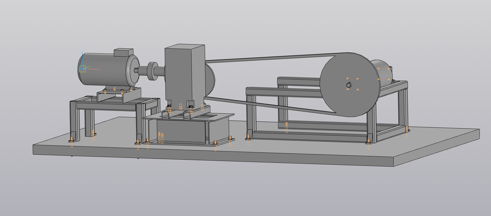
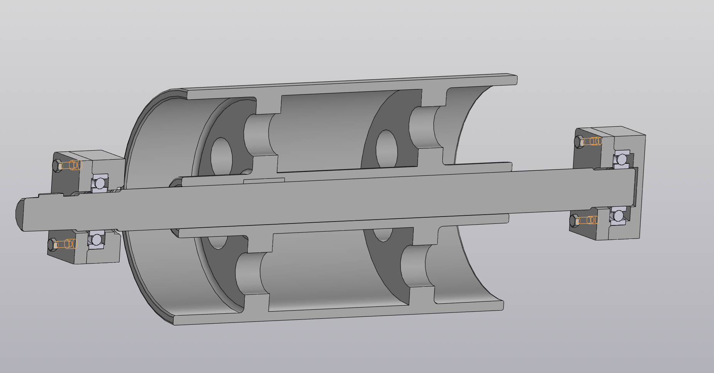

В данной папке лежит курсовой проект по деталям машин. В ходе курсового проекта необходимо разработать приводное устройство приводного транспортера.
Необходимо:
1) произвести кинематическо-силовой расчет привода и выбрать электродвигатель;
2) выбрать червячный редуктор и провести его расчет на прочность;
3) рассчитать цепную передачу;
4) подобрать муфту между валом электродвигателя и червячного редуктора;
5) подобрать вал барабана и подшипники;
6) построить чертежи привода и приводного вала с барабаном.
Вся курсовая работа находится в этой папке, а ниже представлены 3D-модели привода (сборка) и приводного вала с барабаном (сборка).

<b>Показать общий вид привода (кликните, чтобы раскрыть)</b>

<b>Показать приводной вал с барабаном (кликните, чтобы раскрыть)</b>

