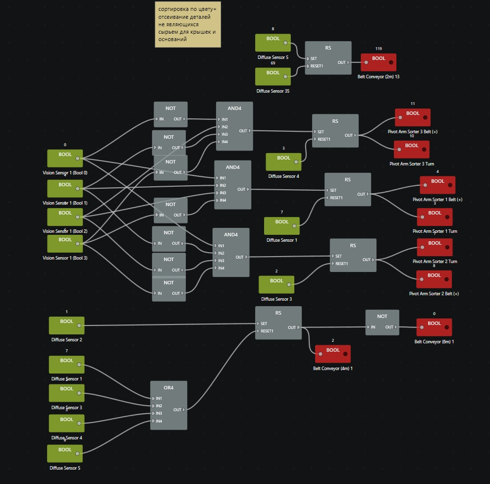
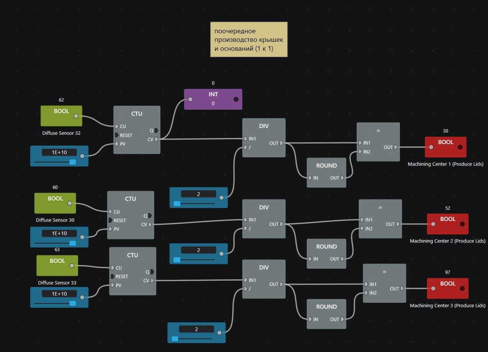
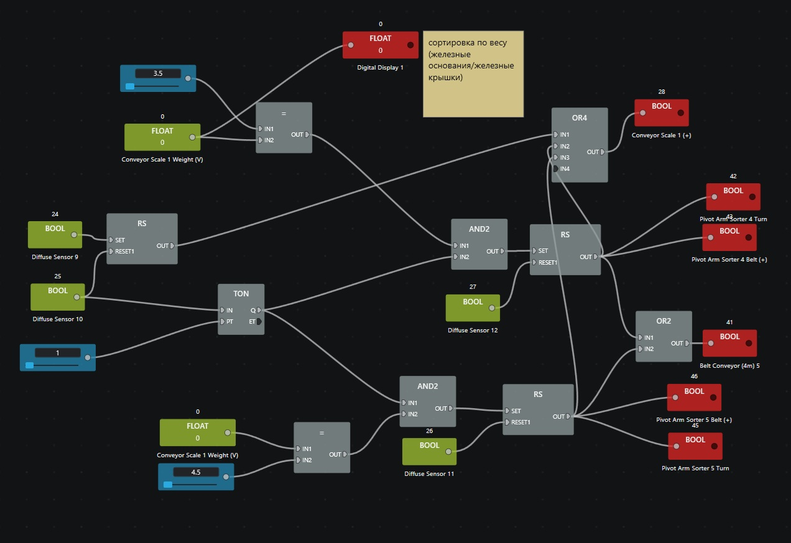

В этой папке лежит проект сортировочного участка с производством из сырья с использованием программы Factory IO и Control IO. 

<video src="factory_content/factory_video.mp4" autoplay loop muted playsinline width="100%"></video>

<b>Показать код для сортировки по цвету (кликните, чтобы раскрыть)</b>

  

<b>Показать код для поочередного производства деталей (кликните, чтобы раскрыть)</b>

  

<b>Показать код для сортировки деталей по весу (кликните, чтобы раскрыть)</b>

  

