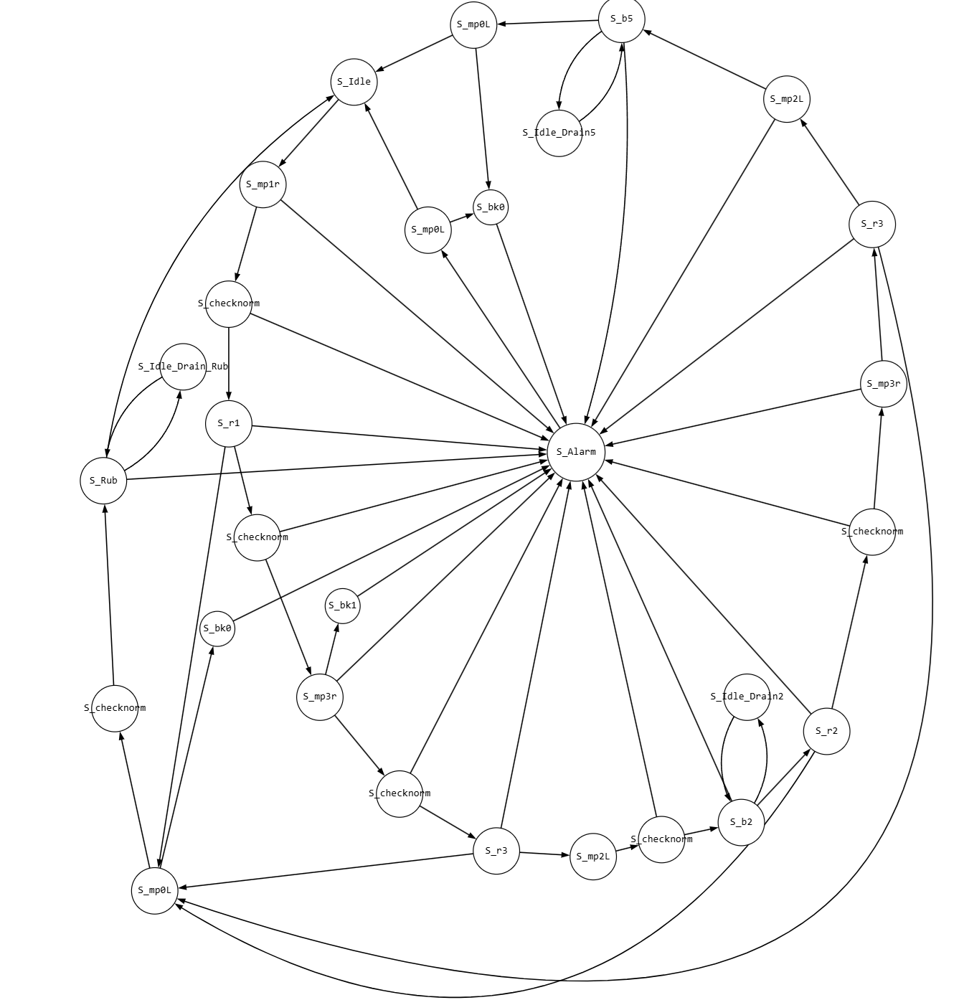

В данной папке лежат все файлы для курсовой работы по теории конечных автоматов (моделирование конечного распределительно-дозировочного автомата). 
Были описаны внутренние состояния конечного автомата. Из-за слишком большого количества состояний вместо использования отдельных состояний было принято решение об использовании групп состояний (для определенного действия, например позиционирования контейнера под определенным резервуаром Ri). Такой подход позволил облегчить графическое и программное представление графа. Графическое представление графа находится ниже.

<b>Показать графическое представление конечного автомата (граф переходов) (кликните, чтобы раскрыть)</b>

